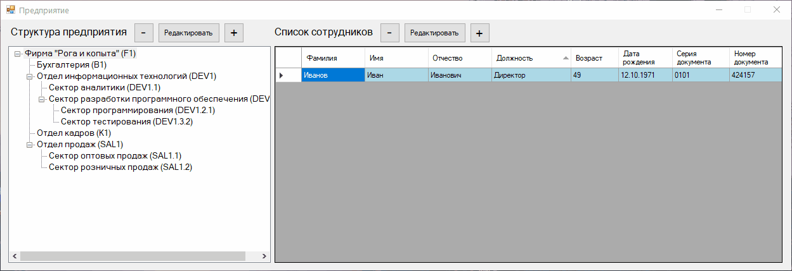
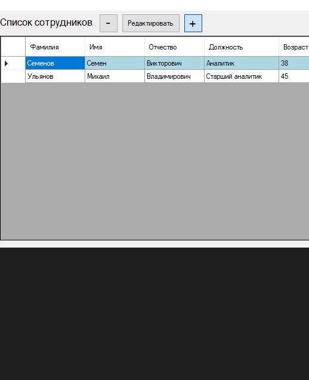
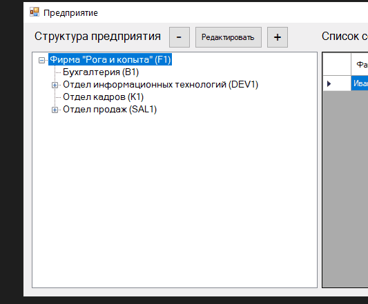

# Описание проекта
WindowsForms приложение на основе базы данных, позволяющее просматривать и вносить в нее изменения.  
Было создано в качестве тестового задания.

# Использованные технологии
- C#, WindowsForms, ADO.Net/Entity Framework, LINQ 
- Приложение написано в Visual Studio 2019, база данных восстановлена через SQL Server Managment Studio.
- Управление версиями: Git Bash

# Демонстрация работы
## Главное окно

## Взаимодействие с записями сотрудников

## Взаимодействие с записями отделов

# Требования к программе
Дана база данных состоящяя из 2 таблиц: отделы фирмы и ее сотрудники.
Создать приложение WindowsForms, позволяющее:
- Отображать структуру отделов предприятия
- Просмотривать список сотрудников выбранного отдела
- Добавлять, удалять и редактироваить записи об отделах и их сотрудниках

# Реализованный функционал
Помимо заявленного в требованиях функционала, исходя из логики, были также добавлены:
- Валидаторы полей и форм
- Отображения причин, по которым поля считаются неверно заполненными
- Автоформатирования полей (приведение к верному регистру)
- Проверки на возможные дубликаты перед записью в базу данных
- Изменения состояния кнопок в соответствие текущему состоянию программы (блокирование кнопок, обновление отображения таблиц и т.д.)
- Вызовы различных сообщений с подтверждениями действий, статусом проведенной операции и т.п.
